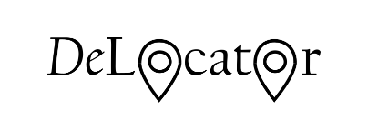
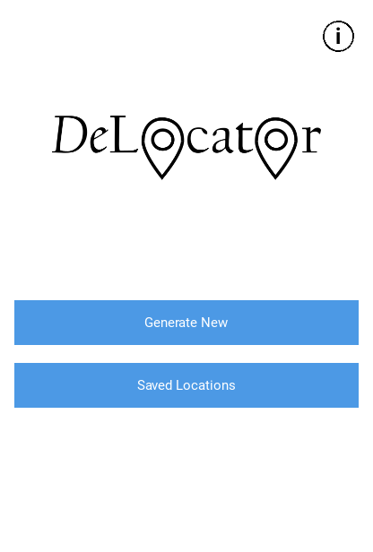
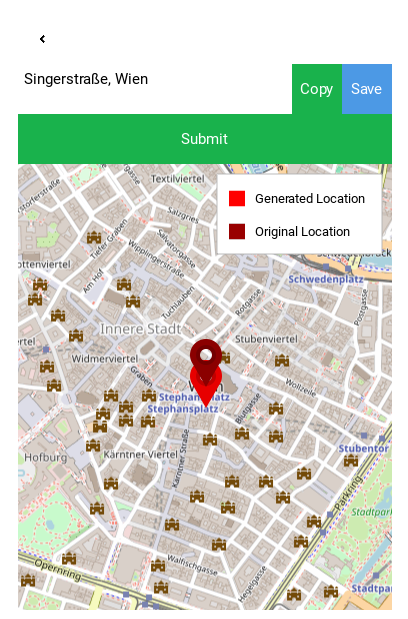

# DeLocator



_DeLocator_ is an Android app, developed as part of a master's thesis, that places location privacy at its core. The application replaces private addresses (such as home or work) with randomly selected, real public places nearby. This enables users to anonymize their actual locations when using delivery services, navigation apps, or other platforms—without sacrificing convenience.

---

## Features

- **Address Anonymization:** Transforms a private address into a random nearby public place within a 500-meter radius
- **OpenStreetMap & Overpass API:** Utilizes open geodata to find places in categories like dining, shopping, healthcare, services, transport, and recreation
- **Interactive Map View:** Clearly displays both the original and anonymized locations
- **Favorites System:** Save up to three anonymized locations with custom icons (e.g., Home, Work, Family) for reuse
- **Android Notifications:** Quickly access saved places directly from the notification center
- **Privacy by Design:** No sensitive data is sent to external servers; all processing is done locally on the device

---

## How It Works

1. **Enter Address:** The user enters an address, which is geocoded using OpenStreetMap (Nominatim)
2. **Search for Public Places:** Real public places from six categories are found within the selected radius
3. **Random Selection:** One of these places is randomly picked as the “anonymized address”
4. **Display & Save:** Both the original and anonymized locations are displayed on a map; the anonymized address can be copied or saved as a favorite

---

## Installation

### Requirements

- Python 3.7+
- [Kivy](https://kivy.org/#download) (>=2.2.1)
- [KivyMD](https://kivymd.readthedocs.io/)
- [Buildozer](https://github.com/kivy/buildozer) (for Android build)

### Required Python Packages

```bash
pip install kivy==2.2.1 kivymd kivy_garden.mapview geopy pyperclip overpass certifi openssl osm2geojson shapely urllib3 plyer
```

### Build for Android

1. Clone the repository:
   ```bash
   git clone https://github.com/Digital-Geography/DeLocator.git
   cd DeLocator
   ```
2. (Optional) Test on desktop:
   ```bash
   python main.py
   ```
3. Build APK for Android:
   ```bash
   buildozer android debug
   ```
4. Transfer and install the APK on your Android device.

---

## Usage

- **Generate a New Location:** Open the app, enter an address, and tap “Submit.” The map will show both the real and anonymized locations.
- **Copy or Save Location:** Copy the anonymized address with a single tap or save it as a favorite.
- **Quick Access:** Copy saved addresses directly from the notification center without opening the app.

---

## Example Screenshots





---

## Privacy

- **Local Processing:** No address data ever leaves your device.
- **Non-deterministic Anonymization:** Each time, a different plausible public place is chosen.
- **OpenStreetMap Data:** Only verified public places are used.

---


## About

_DeLocator_ was developed by **Aldina Kovacevic** as part of a master's thesis exploring the intersection of privacy and usability in location-based services.

- **Development period:** 2024–2025
- **Contact:** For research inquiries, feature requests, or support, please open an issue in this repository.

---

**Thank you for your interest in privacy-friendly location services!**
